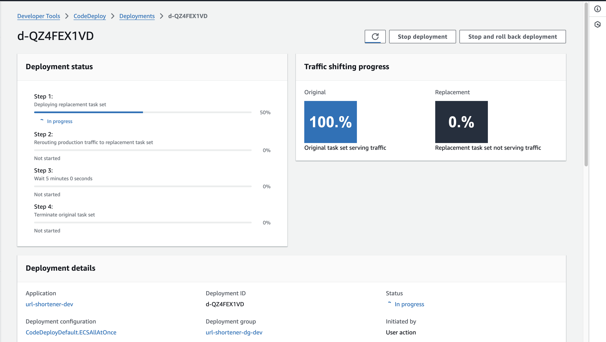
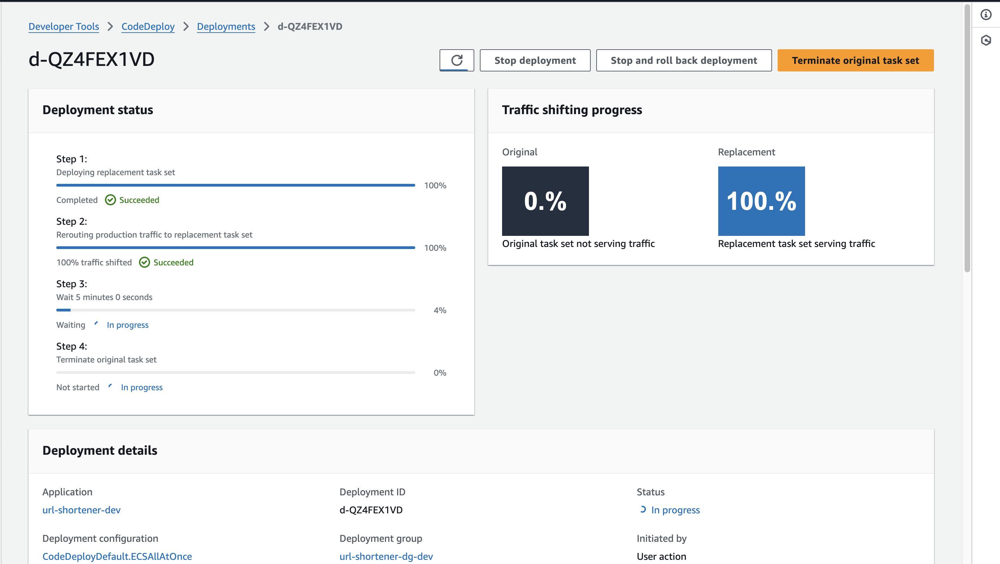
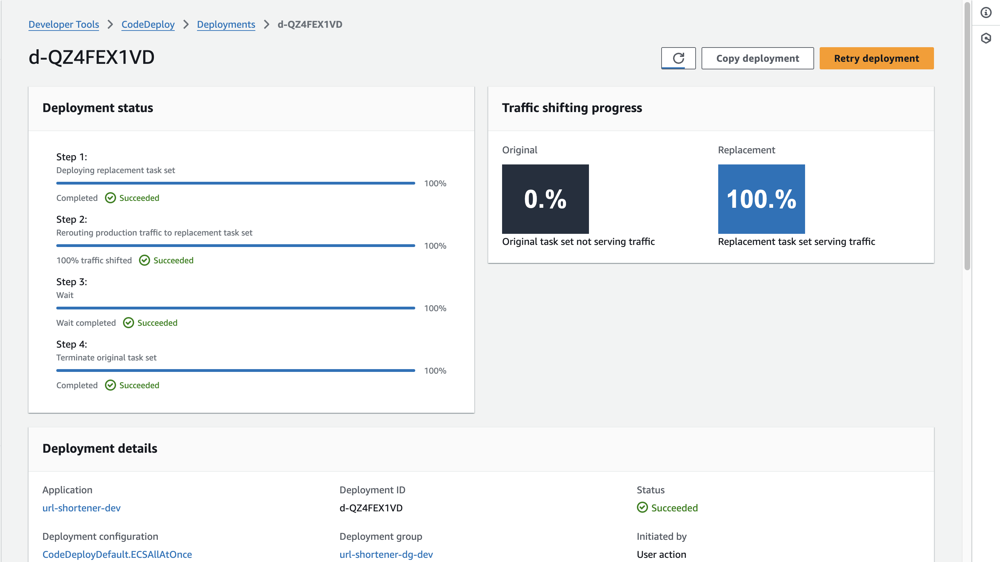

# 🚀 ECS Fargate Blue/Green Deployment with Terraform & CodeDeploy

> **Production-ready URL Shortener with Zero-Downtime Blue/Green Deployments**

[](https://www.terraform.io/)
[](https://aws.amazon.com/fargate/)
[](https://www.python.org/)
[](https://fastapi.tiangolo.com/)
[](https://www.docker.com/)
[](https://github.com/features/actions)
[](LICENSE)

---

## 🎬 Quick Start

**🚀 New to this project?** → [📖 START HERE - Complete Setup Guide](START-HERE.md)

**⚡ Already familiar?** Jump to [Deployment](#-deployment) below.

---

## 📸 Live Demo


**Live Demo:** https://dev.awsapp.cloudycode.dev

---

## 🎯 What is This?

A **production-ready URL shortening service** deployed on **AWS ECS Fargate** with automated **Blue/Green deployments**. This project demonstrates enterprise-grade DevOps practices including Infrastructure as Code, CI/CD pipelines, and zero-downtime deployments.

**Tech Stack:** FastAPI (Python) · ECS Fargate · CodeDeploy · Terraform · GitHub Actions · DynamoDB · ALB · Route53

**What it does:**
- 🔗 Shortens long URLs into shareable links
- 📊 Tracks usage statistics
- ⚡ Serverless containers (no EC2 to manage)
- 🔒 HTTPS-only with custom domain

---

## ✨ What Makes This Production-Ready?

| Feature | Demo/Tutorial | This Project |
|---------|--------------|-------------|
| **Deployment** | Manual or basic | ✅ Automated Blue/Green with CodeDeploy |
| **Infrastructure** | Hardcoded values | ✅ Modular Terraform (9 reusable modules) |
| **CI/CD** | Basic scripts | ✅ GitHub Actions with OIDC (no credentials) |
| **Security** | HTTP, open ports | ✅ HTTPS only, least-privilege IAM, SGs |
| **Monitoring** | None | ✅ CloudWatch Logs, health checks, alarms |
| **Rollback** | Manual | ✅ Automatic on failure |
| **Multi-Environment** | Single env | ✅ Dev/Prod with isolated state |
| **Cleanup** | Manual deletion | ✅ Automated cleanup scripts |
| **Documentation** | Basic README | ✅ Comprehensive docs + START-HERE guide |

---

## 🏗️ Architecture

### High-Level Overview

```
Internet Users
      ↓
Route53 DNS (dev.awsapp.cloudycode.dev)
      ↓
Application Load Balancer (HTTPS)
      ↓
Blue/Green Target Groups
      ↓
ECS Fargate Tasks (Containers)
      ↓
DynamoDB (URL Storage)
```

### Multi-Environment Architecture

```
                    ┌─────────────────────────────────────┐
                    │         Internet Users              │
                    └──────────────┬──────────────────────┘
                                   │
                    ┌──────────────┴──────────────────────┐
                    │                                     │
                    ▼                                     ▼
        ┌───────────────────────┐           ┌───────────────────────┐
        │   DEV Environment     │           │   PROD Environment    │
        │   ┌───────────────┐   │           │   ┌───────────────┐   │
        │   │      ALB      │   │           │   │      ALB      │   │
        │   │  (HTTPS:443)  │   │           │   │  (HTTPS:443)  │   │
        │   └───────┬───────┘   │           │   └───────┬───────┘   │
        │           │           │           │           │           │
        │   ┌───────┴───────┐   │           │   ┌───────┴───────┐   │
        │   ▼               ▼   │           │   ▼               ▼   │
        │ ┌─────┐       ┌─────┐ │           │ ┌─────┐       ┌─────┐ │
        │ │Blue │◄─────►│Green│ │           │ │Blue │◄─────►│Green│ │
        │ │ TG  │       │ TG  │ │           │ │ TG  │       │ TG  │ │
        │ └──┬──┘       └──┬──┘ │           │ └──┬──┘       └──┬──┘ │
        │    │   CodeDeploy │   │           │    │   CodeDeploy │   │
        │    ▼              ▼   │           │    ▼              ▼   │
        │ ┌──────────────────┐  │           │ ┌──────────────────┐  │
        │ │  ECS Fargate     │  │           │ │  ECS Fargate     │  │
        │ │ ┌──────┐ ┌──────┐│  │           │ │ ┌──────┐ ┌──────┐│  │
        │ │ │Task  │ │Task  ││  │           │ │ │Task  │ │Task  ││  │
        │ │ │(Old) │ │(New) ││  │           │ │ │(Old) │ │(New) ││  │
        │ └────┼────────┼────┘  │           │ └────┼────────┼────┘  │
        └──────┼────────┼───────┘           └──────┼────────┼───────┘
               ▼                                   ▼
        ┌───────────────┐                   ┌───────────────┐
        │  DynamoDB     │                   │  DynamoDB     │
        │  (urls-dev)   │                   │  (urls-prod)  │
        └───────────────┘                   └───────────────┘
```

### Key Components

| Component | Purpose | Multi-Env |
|-----------|---------|----------|
| **Route53** | DNS routing | ✅ Per environment |
| **ALB** | Load balancing & SSL | ✅ Per environment |
| **Target Groups** | Blue/Green routing | ✅ Per environment |
| **ECS Fargate** | Serverless containers | ✅ Per environment |
| **CodeDeploy** | Deployment automation | ✅ Per environment |
| **DynamoDB** | NoSQL database | ✅ Per environment |
| **ECR** | Container registry | ✅ Shared |
| **S3** | Terraform state | ✅ Shared |

---

## 📁 Project Structure

```
ecs-fargate-terraform-deployment/
├── app/                         # FastAPI application
│   ├── src/main.py             # Application code
│   ├── Dockerfile              # Multi-stage build
│   └── requirements.txt        # Python dependencies
│
├── terraform/
│   ├── modules/                # 9 reusable modules
│   │   ├── vpc/               # VPC, Subnets, IGW
│   │   ├── security/          # Security Groups
│   │   ├── iam/               # IAM Roles & Policies
│   │   ├── dynamodb/          # DynamoDB Table
│   │   ├── ecr/               # ECR Repository
│   │   ├── alb/               # ALB + Blue/Green TGs
│   │   ├── ecs/               # ECS Cluster & Service
│   │   ├── codedeploy/        # CodeDeploy App & DG
│   │   └── route53/           # DNS Records
│   │
│   └── environments/
│       ├── dev/               # Dev environment
│       └── prod/              # Prod environment
│
├── scripts/
│   ├── 01-setup/              # Initial setup scripts
│   ├── 02-deploy/             # Deployment scripts
│   └── 03-cleanup/            # Cleanup scripts
│
├── .github/workflows/         # CI/CD pipelines
├── images/                    # Screenshots
├── docs/                      # Additional documentation
├── appspec.yml               # CodeDeploy specification
├── START-HERE.md             # Step-by-step guide
└── README.md                 # This file
```

---

## 🚀 Deployment

### Prerequisites

- AWS Account with admin access
- Terraform >= 1.0
- AWS CLI configured
- Git & Docker installed
- (Optional) Custom domain + SSL certificate

### Quick Deploy

```bash
# 1. Clone repository
git clone https://github.com/engabelal/ecs-fargate-terraform-deployment.git
cd ecs-fargate-terraform-deployment

# 2. Setup backend
cd scripts/01-setup
./02-setup-terraform-backend.sh

# 3. Deploy infrastructure
./03-deploy-infrastructure.sh

# 4. Build and push image
cd ../02-deploy
./01-build-and-push-image.sh

# 5. Push to GitHub (triggers CI/CD)
git push origin main
```

**⏱️ Total time:** ~10 minutes

**📖 Detailed Guide:** See [START-HERE.md](START-HERE.md) for complete step-by-step instructions.

---

## 🔵🟢 Blue/Green Deployment

### How It Works

1. **Current State:** Blue (v1.0) receives 100% traffic
2. **New Deployment:** Green (v2.0) starts, health checks run
3. **Traffic Shift:** CodeDeploy switches traffic to Green
4. **Cleanup:** Blue tasks terminated after 5 minutes
5. **Rollback:** Automatic if health checks fail





### Trigger Deployment

```bash
# Make changes to app/
git add app/
git commit -m "Update application"
git push origin main
# GitHub Actions automatically deploys with Blue/Green
```

---

## 🔄 CI/CD Pipeline

### GitHub Actions Workflow

```
Push to main (app/ changes)
  ↓
Configure AWS (OIDC - no credentials)
  ↓
Build Docker Image (multi-stage)
  ↓
Push to ECR (versioned tags)
  ↓
Register ECS Task Definition
  ↓
Create CodeDeploy Deployment
  ↓
Blue/Green Traffic Shift
  ↓
Monitor & Rollback (if needed)
```

### Security Scanning

- **Trivy:** Scans Python dependencies & Docker images for CVEs
- **Checkov:** Scans Terraform for security misconfigurations

---

## 📊 Monitoring & Costs

### CloudWatch Logs

```bash
# Tail logs in real-time
aws logs tail /ecs/url-shortener-dev --follow --region eu-north-1
```

### Monthly Costs (Dev)

| Service | Cost |
|---------|------|
| ECS Fargate (1 task) | ~$10 |
| Application Load Balancer | ~$16 |
| DynamoDB (on-demand) | ~$1 |
| Route53 Hosted Zone | $0.50 |
| Other (ECR, S3, CloudWatch) | <$1 |
| **Total** | **~$27-30/month** |

---

## 🧹 Cleanup

### Automated Cleanup

```bash
# Step 1: Destroy infrastructure
cd scripts/03-cleanup
./01-destroy-infrastructure.sh
# Type 'destroy' to confirm

# Step 2: Cleanup remaining resources
./02-cleanup-resources.sh
# Answer prompts for S3, DynamoDB, Route53
```

**⏱️ Cleanup time:** ~5 minutes

---

## 🔧 Common Issues

### 1. ECR Repository Not Empty

**Error:** `RepositoryNotEmptyException`

**Solution:** The ECR module includes `force_delete = true` which automatically deletes images. If using older version, run cleanup script first.

### 2. Certificate Validation Pending

**Error:** Certificate stuck in "Pending validation"

**Solution:** 
1. Check CNAME record in Route53
2. Ensure record matches ACM validation
3. Wait 5-10 minutes for DNS propagation

### 3. ECS Tasks Failing Health Checks

**Error:** Tasks keep restarting

**Solution:**
```bash
# Check logs
aws logs tail /ecs/url-shortener-dev --follow

# Common causes:
# - Wrong container port (should be 8000)
# - Missing environment variables
# - DynamoDB permissions
```

**More troubleshooting:** See [START-HERE.md](START-HERE.md#troubleshooting)

---

## 📚 Documentation

- **[START-HERE.md](START-HERE.md)** - Complete setup guide
- **[scripts/README.md](scripts/README.md)** - Scripts documentation
- **[docs/ENVIRONMENTS.md](docs/ENVIRONMENTS.md)** - Multi-environment setup

---

## 🤝 Contributing

Contributions welcome! Please feel free to submit a Pull Request.

---

## 📝 License

This project is licensed under the MIT License - see the [LICENSE](LICENSE) file for details.

---

## 👤 Author

**Ahmed Belal**

- GitHub: [@engabelal](https://github.com/engabelal)
- LinkedIn: [Ahmed Belal](https://linkedin.com/in/engabelal)
- Website: [cloudycode.dev](https://www.cloudycode.dev)

---

## ⭐ Show Your Support

If this project helped you, please give it a ⭐️!

---

<div align="center">

**Made with ❤️ by Ahmed Belal**

[⬆ Back to Top](#-ecs-fargate-bluegreen-deployment-with-terraform--codedeploy)

</div>
